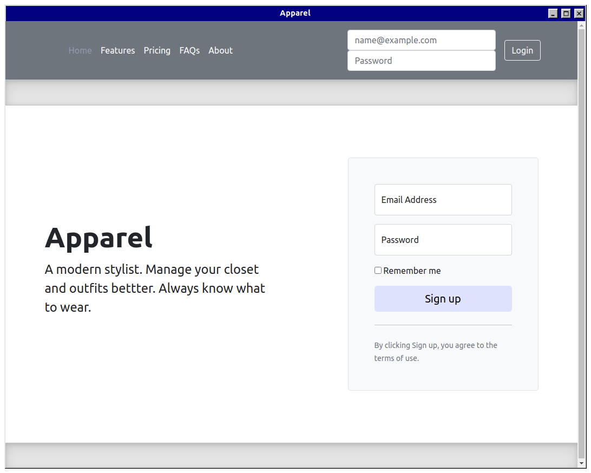
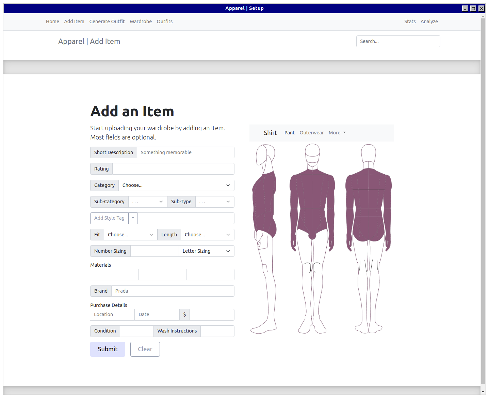
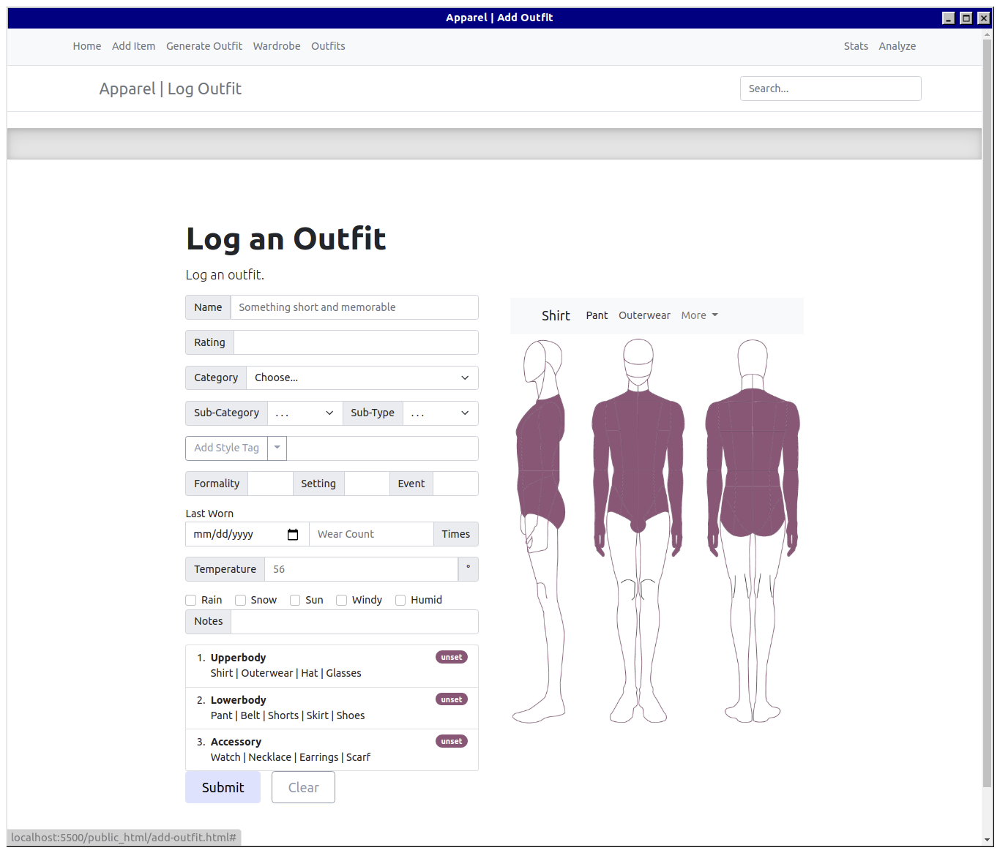

# Final Project | CSC337

[Live 🔴](http://143.198.57.139/) | [Demo Video ▶️](https://bymyself.life/)

**_Author_**: Christian P. Byrne

- [Overview](#overview)
- [Frontend](#frontend)
- [Backend](#backend)
- [Timeline](#timeline)

<a name="overview"/>

# Overview

This webapp will server as a wardrobe manager app. It will work similarly to how a kitchen manager app would work -- by saving recipes (outfits) and suggesting recipes based on avaialble foods (clothes) and defined rulesets/dictionaries (publicly available cookbooks).

Theoretically, the user will, over time, enter information about the items in their closet and about outfits that they wear. The extent of detail entered will depend on the user, but they will have the option to fill out a significant number of fields per item/outfit. The most important fields will be those inputs that are crucial to the app's suggestion algorithms.

The suggestion algorithms will be used to generate new outfits for the sake of convenience -- in a way acting as a stylist. The algorithm will most likely work by (1) using a color matching algorithm, (2) using some ruleset derived from fashion rules I find online, or (3) use patterns found in outfits that the user already has entered and given high ratings to. Or, some combination of these.

But perhaps most helpful, the app will simply serve as a log of outfits. In theory it will be beneifical to have a list of outfits (characterized by each constituent item) and a rating system attached to those oufits -- as well as other sorting parameters like temperature, formality, and so on. If someone spends a portion of their day trying to find the correct clothing items -- constantly forgetting the full extent of their wardrobe and the previous combinations -- this app can help them.

<a name="frontend"/>

# Frontend

 details 

## Frontend

#### Login / Register Page

#### Add Items Page

The required fields will be indicated somehow.

For the item's colors field (the colors of the item the user is adding), I will try to use a library that can parse colors from a picture; but if that turns out to be unrealistic, I will just put a color selector input.

#### Log Outfit Page

It would be ideal to add a lot of functionality to these forms.

I will try to make sections that are collapsible so there is not so much information displayed at once.

The mannequin image should change colors based on the current selection. I have a sketch template that I am photoshopping and am just going to rotate the `` `src` attribute in some event handler.

The list on the bottom left will update as new items are added, and there shuold be as much freedom as possible in terms of how many items a user can add per outfit.

#### Generate Outfit Page

1. Start from one item or one color
2. Get recommendations based on color algorithm, defined rules, and relationships in settings

#### Browse Wardrobe Page

Browse user's items.

#### Browse Outfits Page

Browse user's outfits.

#### Wardrobe Analytics Page ?

If time permits and it's realistic to implement, some analytics based on the data the user passes. For example, where the user spends most money in terms of clothing type.

# Backend

- Auth
- Image Upload
- Routers
- Schemas

 details 

#### Authentification

Authentifcation middleware handler that was taught in the lecture will be passed to `Express.all()` probably, authenticating all routes except `/login`, `/register`, (and `/`?).

Then store username with `sessionStorage` and create a global function to add a username/password attribute to Ajax POSTs -- also allowing the user document to be updated when a new item is posted.

Use the `setInterval` sessionkeys method outlined in the lecture for security.

#### Image Upload

I will use `Multer` from PA10 for image uploads. Maybe I should learn how to set permissions on images, because I have just been storing them in the public directory so far.

#### Schemas 

- User
- Item
- Outfit

Create relationships between **Outfit**, **Item**, and **User** documents using auto-generated `_id` value as key field.

**Outfit** document will have an items field that is an object that has the shape `[itemCategory: string]: _id`.

**User** document will have `items` attribute of the shape`_id[]`.

#### Routers

- POST Login
- POST Register
- POST Item
- POST Outfit
- GET Wardrobe
- GET Outfits
- GET suggestion

# Timeline

- day 1-3
- day 4-7
- day 8-11
- day 12-14

#### Day 1-3

⏩ = low priority

- ✅ App theme
  - ✅ Global SCSS variables
  - ✅ Global page layout
- ✅ Static Resources
  - ✅ sketch images
    - ✅ photoshop fill other elements
    - ✅ female outline
  - ⏩ dictionary infographics
- ✅ Login / Register
  - ✅ HTML
  - ✅ Ajax
  - ✅ Routers
  - ✅ User schema
  - ✅ Authentifcation middleware
  - ✅ cookie middleware
  - ✅ session storage
  - ✅ password hashing
- ✅ Add Outfit & Add Item
  - ✅ connect to user
  - ✅ Interfaces and schemas
  - ✅ Routers
  - ✅ HTML forms
  - ✅ Ajax
- ✅ mannequin gender loading func using dynamic FS functinos
- ✅ Add refresh functions to form submit on add item
- ✅ add mannequin feature to add item page
- ✅ login (not register) client event handlers
- ✅ new user validation (no repeat)
- ⏩ import/export from spreadsheet
  - ✅ backend
  - ⏩ frontend
- ⏩ Info collection
  - ✅ definitions of default field parameters
  - ⏩ definition for tooltips and info modals
  - https://www.insider.com/popular-fashion-trends-history-us-2019-2
  - https://fashionhistory.fitnyc.edu/
  - https://www.crfashionbook.com/fashion/g27033975/fashion-staples-throughout-decade/
  - https://www.whowhatwear.com/fashion-by-the-decade
- ⏩ nav bar over mannequin
- ⏩ navbar features cross-app
- ✅ style tags/badges/chips on item queue
- ✅ User Account Customization
  - ✅ profile pic
  - ✅ gender
    - ✅ determines mannequin type.
  - ✅ account initialization phase
  - ✅ some info can be translated into default form fields?
  - ✅ nickname
  - ✅ preferred algorithms
  - ✅ style tag adding options in forms
  - ✅ sub-category and sub-type dynamic `<select>` options loading
- ⏩ subcategory and type
  - ⏩ defined heirarchy of suggested
  - ⏩ in a datalist
  - ⏩ any new fields that user creates sohuld be added to datalist
  - ⏩ ? user created fields should be placed above defaults in datalist or it should be alphabetical?
- ✅ Input correction/closest match util object
- ⏩ accent colors on add item page

#### Day 4-7

- ⏩ Refactor routers
- add global favicon loader
- ✅ Determine best layout of item card
  -  ✅variability -- most items are optional, determine loading algorithm that makes sense and looks good regardless of fileds that are filled out
- ⏩ Browse style dict on styles tab
- ✅ Client color selection inputs
- ⏩ Color parsing module?
- ✅ Image upload?
  - ✅ add field to schemas
- ✅ Color algorithm
- ⏩ Define ruleset
  - ⏩ Info tooltips/modals
- ⏩ Define algorithmic suggestion
- ⏩ form fields update based on previous selection
- ⏩ Interactive features on generate page
- ✅ side bar with user content on view outfits page: https://getbootstrap.com/docs/5.0/examples/sidebars/
- ✅ Edit global stylesheets
  - ✅ global divider styling
- ⏩ ? outfit details also a nav tab system like add-item fields
- ✅ change text color of tab titles

#### Day 8-11

- ✅ color nearest neighbor
- ✅ color suggest = opening coolor.co with GET request of hex codes
- ✅ Browse wardrobe
  - ✅ DOM constructor functions
  - ✅ Browse wardrobe
    - ✅ HTML & Ajax
- ✅ Browse outfits
  -  ✅ HTML & Ajax
- ⏩ Browse outfits sidebar features
- ✅ browse wardrobe sidebar features
- ✅ Generate page features
  - ✅ Collapsible sections
  - ✅ Navbar collapse feature
- ⏩ Dark mode
- ✅ Tooltips
  - ✅ Using popover system
- ✅ push notifications with toasts
- ✅ badges
- ✅ Search feature -> navigation of site with closest match class
  - ⏩ Defaults to searching wardrobe
- ✅ Navbar and button hrefs
- ⏩ ? make mannequin clickable/hoverable -> show active item

#### Day 12-14

- ✅  ? global search feature
- ⏩ add "required" attribute to inputs maybe.
- ✅ Refactoring/Documenting
  - ✅ frontend ts
  - ✅ backend ts
  - ✅ css
  - ✅ html
- ✅ Debugging
- ✅ Spec Requirements
  - ✅ Your web application should include an in-app help page, which explains to the user (or the grader!) how to use the application. You must have an obviously-located button that a user can click on to get the the help page.
    - ✅ HELP button that is pointed at by popover on page load
    - ✅ help page is a carousel of videos with captions
  - ✅ The application must have a user account creation and login feature, with proper password salting/hashing, and login sessions.
  - ✅ Your web application must be made LIVE on the web for at least 5 days after the due date. The URL should be in a file named live.txt in the zip file you submit. It is VERY important for you to have it running live. You may lose a significant amount of points if you don’t have this for the 5 days.
- ✅ Bundling
- ✅ Documenting/Commenting
  - ✅ frontend
  - ✅ backend
  - ✅ backend imports
- ⏩ tucks
- ⏩ undertones
- ⏩ Pruning
- ✅ Testing deployment
- ✅ Testing users
- ✅ Testing mobile
- ✅ Final Demo Video -> Upload
  - ✅ 5-8 minute screen-capture recording, showing off the final project.
  - ✅ demonstrate as many of the site features as possible. 
  - ✅ You should upload this video to a site such as Youtube or Vimeo. 
  - ✅ include a link to this in a file called video.txt in your zipped submission.
  - ✅ You should submit your entire project in a zip file via gradescope (including live.txt and video.txt) by August 6th at 11:59pm. It is critical for you to have your application live on the web, and your video presentation created when you submit. If you don’t, you may be subject to lose a significant amount of points. On grdescope, you’ll be able to submit this as a team.
- ✅ subcategory and type datalist dynamnic fileds based on fashion dictionary schematics/blueprints/guides
- ✅ un-comment main frontend script for correct routes
- ⏩ item field categoris dynamically added to `add-item` page based on specific item details (reference description of items in spreadsheet)
- ✅ placeholder image is the patterns/gradient of colors/prints
- ⏩ feature to `setInterval` update toast time element
- ⏩ sort feature on wardrobe and items page sidebars
- ✅ Validate HTML
---------

#### Week 3 - Post-Production

Week 3:
-	inspo page with carousal
-	nav on outfits page
-	list groups break points
-	use coolors.co to parse colors
-	? different navbar on mobile 
-	suggest features
  -	infographics
  -	dictionary
  -	✅ color suggest palette api
  -	color suggest algorithm » find closest match in wardrobe
  -	ruleset
-	✅ merge server folder to main repo 
-	filter should add cumulatively (front and backedn)
-	more accents
-	validate html
-	domain name
  -	namecheap free domain
  -	name.com free domain
-	cookie validator headers should be string literal for URLs
  -	and domain on cookies creator method
-	fix registration user account details page
  -	then add user account view/edit page
-	edit item modal
-	analytics page
-	item card listgroup boxes should have a media query CSS declaration 
-	screen padding of main container should have media query
-	outfits page should have less padding on desktop view
-	fix ids of outfits tabs and other tabs (html validator will find broken links)
-	wornontv integration
-	✅ demo page link on README
-	add skirt and accents for women
-	favicon feature
- improve color gradient preview/item-avatar system

#### Brainstorm Features

- Similar: [Dress me app](https://www.dress-meapp.com/)
- Color selection from picture such as feature on [coolors.co](https://coolors.co/)

